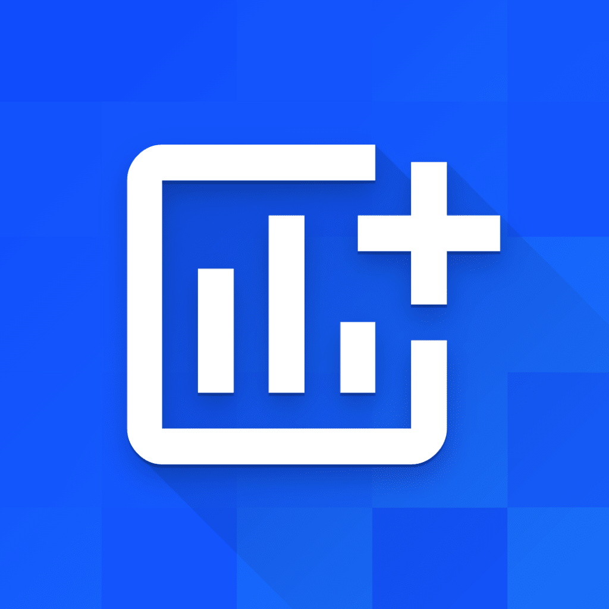

# Dividending

## Description

Dividending is a powerful iOS app built in Swift & UIKit that helps you track and achieve your stock investment goals. Whether you're a seasoned investor or just starting out, Dividending provides an intuitive interface and robust features to make managing your stock portfolio a breeze.

## Developer

Dividending is developed by Patrick Fonseca, a passionate iOS developer dedicated to creating high-quality and user-friendly apps. 

Visit [Patrick Fonseca's website](https://bento.me/patrickfcf) to learn more about the developer and other exciting projects.

## Technical Details

- Language: Swift & Objective-C
- Frameworks and APIs used:
  - Firebase: Harnesses the power of Firebase to store and synchronize user data securely across devices.
  - RevenueCat: Integrates RevenueCat to enable seamless in-app purchases and subscription management.
  - NASDAQ-API: Utilizes the Stocks-API to retrieve real-time stock data, providing users with up-to-date market information.
  - GitHub: Leverages GitHub for version control and collaborative development.
  - ApplePay: Provides a seamless and secure in-app payment experience using ApplePay.
  - iCloudKit: Utilizes iCloudKit for seamless data syncing and storage across multiple devices.

## Features

- The app offers 4 main flows: **Dashboard**, **News**, **Calendar**, and **Trending**.
- The dashboard flow is where the user can add stocks to their portfolio, set an annual income goal and see upcoming dividend payments for their portfolio.
- The news flow will show the latest financial news, fetched directly from the NASDAQ API. Tapping on a news article will open the iOS browser.
- The calendar flow is meant to show a list of stocks that have the ex-dividend date as today's date.
- The trending flow simply shows a list of stocks that are defined in the AppConfig file. This is a great opportunity to add new stocks with new app releases while keeping the app up to date and testing different ASO strategies with each app update. 
- When searching for a stock, the list will show up to 10 results. Selecting a stock will allow users to either add a new position if they currently don't own that stock or update an existing position. The portfolio data is saved in Core Data.
- Updating an existing position, will simply update the data entered by the user. The app doesn't calculate any price differences or cost basis averages. It simply updates the entire position with the new updated information provided by the user.
- The invested amount, shows how much the user invested. This amount doesn't update based on stock price changes. The app doesn't track any stock prices, it's simply meant for tracking the dividends. Make sure to check out the opportunities section below, to get some inspiration for new features.
- By default, the user is able to add only 5 stocks to their portfolio for free, and you can update this value in AppConfig. The users can unlock an unlimited portfolio option via in-app purchases.
- In-App Purchases are handled via a private framework. This framework doesn't support subscriptions.

## Get Started

To get started with Dividending, simply download the app from the App Store and create an account. Begin setting your stock investment goals and managing your portfolio with ease.

We welcome your feedback and suggestions! Feel free to reach out to us at [support@dividending.io](mailto:support@dividending.iom) with any questions or concerns. Happy investing with Dividending!
